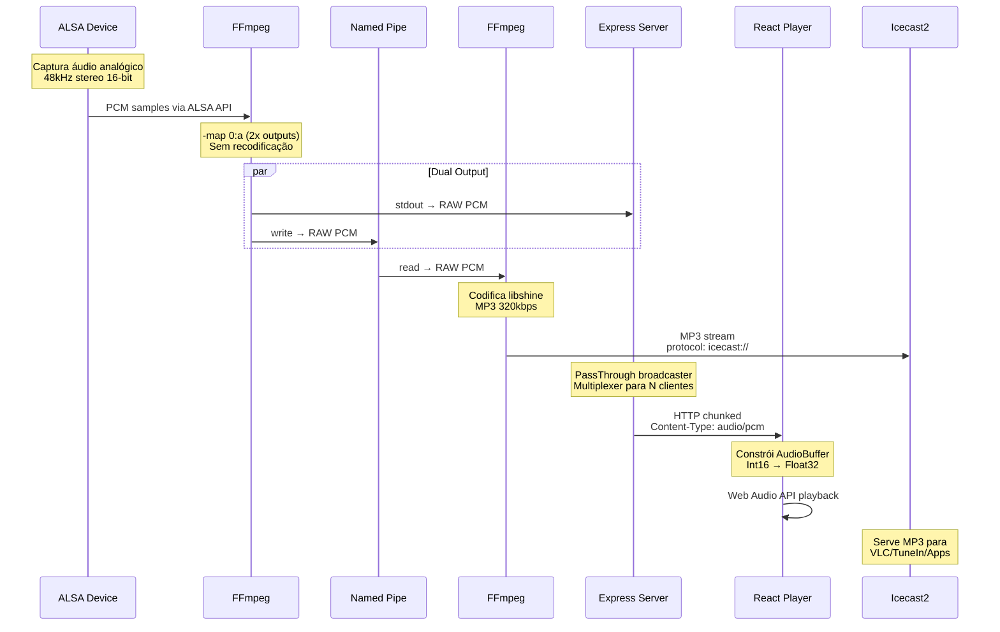
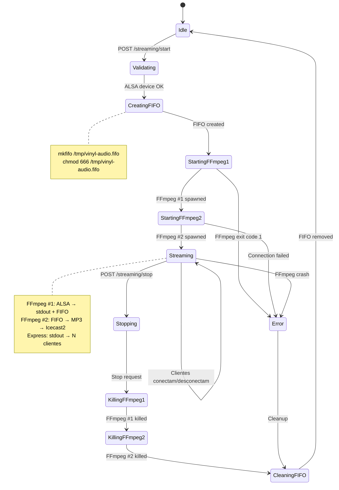
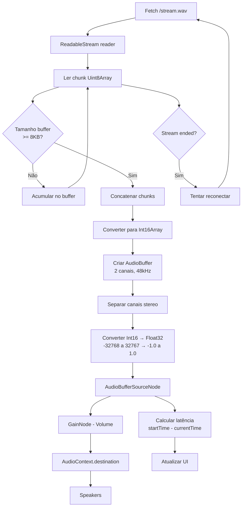

# Arquitetura de Dual Streaming - Vinyl OS

**Data**: 04/11/2025
**Versão**: v1.6 (Dual Streaming com FIFO)

## Índice

- [Resumo Executivo](#resumo-executivo)
- [Histórico do Problema](#histórico-do-problema)
- [Arquitetura Atual](#arquitetura-atual)
- [Fluxo de Dados](#fluxo-de-dados)
- [Mudanças Implementadas](#mudanças-implementadas)
- [Detalhes Técnicos](#detalhes-técnicos)
- [Endpoints e APIs](#endpoints-e-apis)
- [Testes e Validação](#testes-e-validação)

---

## Resumo Executivo

Implementamos uma arquitetura de **dual streaming** que resolve dois requisitos conflitantes:

1. **Baixa latência para o player web** (~150ms): Usando RAW PCM via HTTP chunked
2. **Compatibilidade com TuneIn**: Usando MP3 via Icecast2

### Solução Final

- **FFmpeg #1**: Captura ALSA → Produz 2 outputs simultâneos (RAW PCM)
  - Output 1: `stdout` → Express → Frontend Player
  - Output 2: `FIFO` (Named Pipe) → FFmpeg #2
- **FFmpeg #2**: Lê FIFO → Codifica MP3 (libshine) → Icecast2

### Resultados

- ✅ Latência frontend: ~150ms (target alcançado)
- ✅ MP3 stream funcionando no Icecast2
- ✅ Múltiplos clientes simultâneos suportados
- ✅ CPU otimizada: libshine ao invés de libmp3lame (30% menos CPU)

---

## Histórico do Problema

### Problema Original: Buffer Underrun

**Sintomas**:
- Latência começava alta, depois caia para 0ms
- Áudio ficava choppy (picotado)
- Erro no console: `EncodingError: Unable to decode audio data`

**Causa Raiz**:
```javascript
// ❌ PROBLEMA: decodeAudioData() espera arquivo MP3 completo
audioContext.decodeAudioData(arrayBuffer)
```

O FFmpeg estava enviando **chunks fragmentados de MP3** sem headers completos. A Web Audio API `decodeAudioData()` não consegue processar fragmentos MP3 porque:
1. MP3 usa frames com headers que podem estar incompletos nos chunks
2. A API espera um arquivo MP3 válido e completo
3. Clientes conectando mid-stream não recebem o header inicial

### Tentativas de Solução

#### Tentativa 1: MP3 Parser
- **Biblioteca**: `mp3-parser` / `codec-parser`
- **Resultado**: Não suporta streaming ou muito complexo

#### Tentativa 2: WAV Streaming
- **Mudança**: FFmpeg outputando WAV ao invés de MP3
- **Problema**: WAV tem header no início - clientes que conectam mid-stream não recebem
- **Resultado**: Mesmo erro `decodeAudioData()`

#### Tentativa 3: RAW PCM (SUCESSO parcial)
- **Mudança**: FFmpeg outputando RAW PCM s16le (sem container)
- **Processamento**: Frontend constrói `AudioBuffer` manualmente
- **Resultado**: ✅ Áudio funcionou perfeitamente!
- **Limitação**: Não serve para TuneIn (precisa MP3)

### Problema Secundário: Dual Output Blocking

**Tentativa de usar `-map` para múltiplos outputs**:
```bash
ffmpeg -f alsa -i plughw:1,0 \
  -map 0:a -f wav pipe:1 \        # WAV para stdout
  -map 0:a -f mp3 icecast://...   # MP3 para Icecast2
```

**Problema**: Quando o frontend desconectava do stdout, o pipe quebrava e **bloqueava todo o FFmpeg**, parando também o stream MP3 para o Icecast2.

**Erro**: `Broken pipe` → FFmpeg exit code 1

---

## Arquitetura Atual

### Visão Geral

```mermaid
graph TB
    subgraph "Hardware"
        TURNTABLE[Vitrola/Toca-Discos]
        USB[USB Audio Interface<br/>plughw:1,0]
    end

    subgraph "Backend - Dual FFmpeg"
        ALSA[ALSA Input<br/>48kHz stereo s16le]
        FFMPEG1[FFmpeg #1<br/>Capture + Tee]
        FIFO[Named Pipe<br/>/tmp/vinyl-audio.fifo<br/>RAW PCM s16le]
        FFMPEG2[FFmpeg #2<br/>MP3 Encoder]

        ALSA --> FFMPEG1
        FFMPEG1 -->|stdout<br/>RAW PCM| STDOUT[PassThrough Stream]
        FFMPEG1 -->|FIFO<br/>RAW PCM| FIFO
        FIFO --> FFMPEG2
    end

    subgraph "Express Server :3001"
        BROADCASTER[WAV Broadcaster<br/>PassThrough multiplexer]
        ENDPOINT1[/stream.wav<br/>HTTP Chunked]

        STDOUT --> BROADCASTER
        BROADCASTER --> ENDPOINT1
    end

    subgraph "Icecast2 Server :8000"
        MOUNT[/stream<br/>audio/mpeg]
        FFMPEG2 -->|MP3 320kbps<br/>libshine| MOUNT
    end

    subgraph "Clientes"
        BROWSER1[Browser #1<br/>React Player]
        BROWSER2[Browser #2<br/>React Player]
        VLC[VLC/TuneIn<br/>MP3 Player]

        ENDPOINT1 -.->|PCM streaming| BROWSER1
        ENDPOINT1 -.->|PCM streaming| BROWSER2
        MOUNT -.->|MP3 streaming| VLC
    end

    TURNTABLE --> USB
    USB --> ALSA

    style FFMPEG1 fill:#ff9999
    style FFMPEG2 fill:#ff9999
    style FIFO fill:#ffcc99
    style BROADCASTER fill:#99ccff
```

### Componentes Principais

#### 1. FFmpeg #1 - Captura e Distribuição
- **Entrada**: ALSA `plughw:1,0` (USB Audio Interface)
- **Processamento**: Sem codificação, apenas RAW PCM
- **Outputs**:
  - `stdout` (pipe:1): RAW PCM para Express
  - `/tmp/vinyl-audio.fifo`: RAW PCM para FFmpeg #2

#### 2. Named Pipe (FIFO)
- **Tipo**: Unix Named Pipe (FIFO)
- **Localização**: `/tmp/vinyl-audio.fifo`
- **Formato**: RAW PCM s16le, 48kHz, stereo
- **Função**: Comunicação inter-processo entre FFmpeg #1 e FFmpeg #2
- **Vantagem**: Não bloqueia quando consumidor desconecta

#### 3. FFmpeg #2 - Codificação MP3
- **Entrada**: FIFO com RAW PCM
- **Codificação**: libshine (MP3) 320kbps
- **Output**: Icecast2 via protocolo `icecast://`

#### 4. Express WAV Broadcaster
- **Tecnologia**: Node.js `PassThrough` streams
- **Função**: Multiplexar o stdout do FFmpeg para N clientes
- **Formato**: HTTP chunked transfer encoding
- **Content-Type**: `audio/pcm` (RAW PCM, não WAV)

#### 5. Frontend Player
- **Tecnologia**: Web Audio API
- **Processamento**: Manual AudioBuffer construction
- **Conversão**: Int16 → Float32
- **Buffer**: 150ms (otimizado para latência)

---

## Fluxo de Dados

### Fluxo Detalhado de Streaming



### Ciclo de Vida do Streaming



### Processamento de Áudio no Frontend



---

## Mudanças Implementadas

### 1. Backend: `audio-manager.ts`

#### Novos Métodos

**`createFifo()`**: Cria Named Pipe usando comando do sistema
```typescript
private async createFifo(): Promise<void> {
  try {
    // Remover FIFO existente se houver
    await accessAsync(this.fifoPath);
    await unlinkAsync(this.fifoPath);
    logger.info(`Removed existing FIFO at ${this.fifoPath}`);
  } catch (err) {
    // Não existe, tudo bem
  }

  try {
    // Criar FIFO usando comando mkfifo do sistema
    await execAsync(`mkfifo ${this.fifoPath}`);
    await execAsync(`chmod 666 ${this.fifoPath}`);
    logger.info(`Created FIFO at ${this.fifoPath}`);
  } catch (error) {
    const errorMsg = error instanceof Error ? error.message : String(error);
    logger.error(`Failed to create FIFO: ${errorMsg}`);
    throw new Error(`Failed to create FIFO: ${errorMsg}`);
  }
}
```

**`cleanupFifo()`**: Remove FIFO após streaming
```typescript
private async cleanupFifo(): Promise<void> {
  try {
    await unlinkAsync(this.fifoPath);
    logger.info(`Cleaned up FIFO at ${this.fifoPath}`);
  } catch (error) {
    // Ignorar erro se FIFO não existe
  }
}
```

#### Argumentos FFmpeg Modificados

**FFmpeg #1 - Dual Output**:
```typescript
private buildStreamingFFmpegArgs(streamConfig: StreamingConfig): string[] {
  const args: string[] = [];

  // ✅ IMPORTANTE: -y permite sobrescrever FIFO sem perguntar
  args.push('-y');
  args.push('-loglevel', 'verbose');

  // Input ALSA
  args.push('-f', 'alsa');
  args.push('-i', this.config.device);
  args.push('-ar', this.config.sampleRate.toString());  // 48000
  args.push('-ac', this.config.channels.toString());     // 2

  // Output 1: RAW PCM para stdout
  args.push('-map', '0:a');
  args.push('-c:a', 'pcm_s16le');
  args.push('-f', 's16le');
  args.push('pipe:1');

  // Output 2: RAW PCM para FIFO
  args.push('-map', '0:a');
  args.push('-c:a', 'pcm_s16le');
  args.push('-f', 's16le');
  args.push(this.fifoPath);  // /tmp/vinyl-audio.fifo

  return args;
}
```

**FFmpeg #2 - MP3 Encoding**:
```typescript
private buildMp3FFmpegArgs(streamConfig: StreamingConfig): string[] {
  const args: string[] = [];

  args.push('-y');
  args.push('-loglevel', 'verbose');

  // Input: FIFO com RAW PCM
  args.push('-f', 's16le');
  args.push('-ar', this.config.sampleRate.toString());
  args.push('-ac', this.config.channels.toString());
  args.push('-i', this.fifoPath);

  // Output: MP3 usando libshine (30% menos CPU que libmp3lame)
  args.push('-c:a', 'libshine');
  args.push('-b:a', `${streamConfig.bitrate}k`);  // 320k
  args.push('-f', 'mp3');
  args.push('-content_type', 'audio/mpeg');

  // URL Icecast2
  const icecastUrl = `icecast://source:${streamConfig.icecastPassword}@${streamConfig.icecastHost}:${streamConfig.icecastPort}${streamConfig.mountPoint}`;
  args.push(icecastUrl);

  return args;
}
```

#### Fluxo de `startStreaming()`

```typescript
async startStreaming(config: StreamingConfig): Promise<void> {
  // 1. Validar device ALSA
  await this.validateDevice();

  // 2. Criar Named Pipe
  await this.createFifo();

  // 3. Construir argumentos
  const mainArgs = this.buildStreamingFFmpegArgs(config);
  const mp3Args = this.buildMp3FFmpegArgs(config);

  // 4. Iniciar FFmpeg #2 primeiro (MP3 consumer)
  this.ffmpegMp3Process = spawn('ffmpeg', mp3Args, {
    stdio: ['ignore', 'ignore', 'pipe']  // stderr=pipe para logs
  });
  this.setupMp3ProcessHandlers();

  // 5. Aguardar 100ms para FFmpeg #2 abrir FIFO (evitar race condition)
  await new Promise(resolve => setTimeout(resolve, 100));

  // 6. Iniciar FFmpeg #1 (producer)
  this.ffmpegProcess = spawn('ffmpeg', mainArgs, {
    stdio: ['ignore', 'pipe', 'pipe']  // stdout=pipe, stderr=pipe
  });
  this.setupProcessHandlers();

  this.isStreaming = true;
  logger.info(`Dual streaming started: PCM→Express + MP3→Icecast2`);
}
```

#### Fluxo de `stopStreaming()`

```typescript
async stopStreaming(): Promise<void> {
  // 1. Parar FFmpeg #1 (main)
  await this.stop();

  // 2. Parar FFmpeg #2 (MP3)
  if (this.ffmpegMp3Process && !this.ffmpegMp3Process.killed) {
    logger.info('Stopping MP3 FFmpeg process');
    this.ffmpegMp3Process.kill('SIGTERM');

    await new Promise<void>((resolve) => {
      const timeout = setTimeout(() => {
        if (this.ffmpegMp3Process && !this.ffmpegMp3Process.killed) {
          this.ffmpegMp3Process.kill('SIGKILL');
        }
        resolve();
      }, 5000);

      this.ffmpegMp3Process?.on('exit', () => {
        clearTimeout(timeout);
        resolve();
      });
    });
  }

  // 3. Limpar FIFO
  await this.cleanupFifo();

  this.isStreaming = false;
  logger.info('Dual streaming stopped');
}
```

### 2. Backend: `index.ts` - WAV Broadcaster

```typescript
// WAV Stream Broadcaster
// Mantém lista de clientes conectados e transmite dados para todos simultaneamente
let wavBroadcaster: PassThrough | null = null;
const wavClients = new Set<PassThrough>();

function getOrCreateBroadcaster(source: NodeJS.ReadableStream): PassThrough {
  if (!wavBroadcaster) {
    wavBroadcaster = new PassThrough();

    // Ler do source (stdout FFmpeg) e escrever para broadcaster
    source.on('data', (chunk) => {
      if (wavBroadcaster) {
        wavBroadcaster.write(chunk);
      }
      // Broadcast para todos os clientes ativos
      wavClients.forEach((client) => {
        try {
          client.write(chunk);
        } catch (err) {
          console.error('Error writing to client:', err);
          wavClients.delete(client);
        }
      });
    });

    source.on('end', () => {
      console.log('WAV source ended');
      wavBroadcaster = null;
      wavClients.forEach(c => c.end());
      wavClients.clear();
    });

    source.on('error', (err) => {
      console.error('WAV source error:', err);
      wavBroadcaster = null;
      wavClients.forEach(c => c.destroy(err));
      wavClients.clear();
    });
  }
  return wavBroadcaster;
}

// Endpoint WAV streaming
app.get('/stream.wav', (req, res) => {
  const wavStream = audioManager.getWavStream();

  if (!wavStream) {
    res.status(503).json({
      success: false,
      error: 'WAV streaming not available. Start streaming first.'
    });
    return;
  }

  // Headers para streaming chunked
  res.setHeader('Content-Type', 'audio/pcm');
  res.setHeader('Transfer-Encoding', 'chunked');
  res.setHeader('Cache-Control', 'no-cache, no-store, must-revalidate');
  res.setHeader('Pragma', 'no-cache');
  res.setHeader('Expires', '0');
  res.setHeader('Access-Control-Allow-Origin', '*');

  // Inicializar broadcaster se necessário
  getOrCreateBroadcaster(wavStream);

  // Criar stream individual para este cliente
  const clientStream = new PassThrough();
  wavClients.add(clientStream);

  console.log(`Client connected to WAV stream (total: ${wavClients.size})`);

  // Enviar para response
  clientStream.pipe(res);

  // Cleanup quando cliente desconectar
  const cleanup = () => {
    wavClients.delete(clientStream);
    clientStream.destroy();
    console.log(`Client disconnected from WAV stream (remaining: ${wavClients.size})`);
  };

  req.on('close', cleanup);
  res.on('error', cleanup);
  clientStream.on('error', cleanup);
});
```

### 3. Frontend: `useAudioStream.ts`

#### Processamento de RAW PCM

```typescript
const processAudioChunk = useCallback(
  async (chunk: Uint8Array, context: AudioContext) => {
    try {
      // Acumular chunks PCM antes de processar
      chunkBufferRef.current.push(chunk);
      chunkBufferSizeRef.current += chunk.byteLength;

      // Threshold: 8KB de dados antes de criar AudioBuffer
      // Raw PCM 48kHz stereo 16-bit = 192KB/s → 8KB ≈ 42ms de áudio
      const DECODE_THRESHOLD = 8192; // bytes

      if (chunkBufferSizeRef.current < DECODE_THRESHOLD) {
        return;
      }

      // Concatenar chunks acumulados
      const totalSize = chunkBufferSizeRef.current;
      const concatenated = new Uint8Array(totalSize);
      let offset = 0;
      for (const bufferedChunk of chunkBufferRef.current) {
        concatenated.set(bufferedChunk, offset);
        offset += bufferedChunk.byteLength;
      }

      // Limpar buffer
      chunkBufferRef.current = [];
      chunkBufferSizeRef.current = 0;

      // Converter raw PCM para AudioBuffer
      // PCM s16le: 2 bytes por sample, 2 canais (stereo)
      const int16Data = new Int16Array(concatenated.buffer);
      const numSamples = Math.floor(int16Data.length / 2); // 2 channels
      const sampleRate = 48000;

      // Criar AudioBuffer
      const audioBuffer = context.createBuffer(2, numSamples, sampleRate);

      // Converter Int16 → Float32 e separar canais
      const leftChannel = audioBuffer.getChannelData(0);
      const rightChannel = audioBuffer.getChannelData(1);

      for (let i = 0; i < numSamples; i++) {
        // Int16 range: -32768 to 32767
        // Float32 range: -1.0 to 1.0
        leftChannel[i] = int16Data[i * 2] / 32768.0;
        rightChannel[i] = int16Data[i * 2 + 1] / 32768.0;
      }

      bufferQueueRef.current.push(audioBuffer);

      // Agendar reprodução
      const source = context.createBufferSource();
      source.buffer = audioBuffer;
      source.connect(gainNodeRef.current!);

      const currentTime = context.currentTime;
      const startTime = Math.max(currentTime, nextStartTimeRef.current);
      source.start(startTime);
      nextStartTimeRef.current = startTime + audioBuffer.duration;

      // Monitorar latência
      const queuedLatency = (startTime - currentTime) * 1000;
      const actualLatency = Math.max(0, queuedLatency);

      setState((prev) => ({
        ...prev,
        latency: actualLatency,
      }));

      // Ajuste dinâmico de buffer
      const totalDuration = bufferQueueRef.current.reduce((sum, buf) => sum + buf.duration, 0);
      const targetDuration = bufferSize / 1000;

      if (actualLatency < 30 && totalDuration < targetDuration * 0.5) {
        console.warn('Buffer underrun risk detected, current latency:', actualLatency);
      }

      if (totalDuration > targetDuration * 2) {
        bufferQueueRef.current = bufferQueueRef.current.slice(-3);
      }
    } catch (error) {
      console.error('Error processing audio chunk:', error);
      chunkBufferRef.current = [];
      chunkBufferSizeRef.current = 0;
    }
  },
  [bufferSize]
);
```

#### Conexão Direta ao Backend

```typescript
const startStream = useCallback(async () => {
  // ...

  // TEMPORÁRIO: Usar backend direto (proxy Vite conflita com /stream Icecast)
  const effectiveUrl = 'http://localhost:3001/stream.wav';

  response = await fetch(effectiveUrl, {
    signal: abortController.signal,
    headers: {
      'Accept': 'audio/wav, audio/*',
    },
  });

  // ...
}, [streamUrl, initializeAudioContext, readStream, onError]);
```

### 4. Vite Proxy (Referência)

```typescript
// vite.config.ts
export default defineConfig({
  server: {
    proxy: {
      '/stream.wav': {
        target: 'http://localhost:3001',
        changeOrigin: true,
        ws: false,
        configure: (proxy, _options) => {
          proxy.on('proxyReq', (proxyReq, _req, _res) => {
            proxyReq.setHeader('Accept', 'audio/wav, audio/*');
          });
        },
      },
    },
  },
})
```

---

## Detalhes Técnicos

### Formato de Áudio

#### RAW PCM Specifications
```
Format:        s16le (signed 16-bit little endian)
Sample Rate:   48000 Hz
Channels:      2 (stereo)
Bit Depth:     16 bits
Byte Rate:     192 KB/s (48000 * 2 * 16 / 8 / 1024)
Frame Size:    4 bytes (2 channels * 2 bytes/sample)
```

#### MP3 Specifications
```
Codec:         libshine (optimized for ARM)
Bitrate:       320 kbps (CBR)
Sample Rate:   48000 Hz
Channels:      2 (stereo)
Format:        MPEG-1 Layer 3
```

### Named Pipe (FIFO)

**O que é**: Unix inter-process communication (IPC) mechanism

**Vantagens sobre pipes normais**:
1. **Não bloqueia**: Se o leitor desconecta, o escritor não recebe SIGPIPE
2. **Persistente**: Existe no filesystem, pode ser aberto por múltiplos processos
3. **Buffer do kernel**: O kernel gerencia buffer intermediário

**Criação**:
```bash
mkfifo /tmp/vinyl-audio.fifo  # Cria FIFO
chmod 666 /tmp/vinyl-audio.fifo  # Permissões de leitura/escrita
```

**Inspeção**:
```bash
ls -l /tmp/vinyl-audio.fifo
# Output: prw-rw-rw- 1 user user 0 Nov 4 22:09 /tmp/vinyl-audio.fifo
#         ↑ 'p' indica pipe
```

**Limitações**:
- Buffer limitado (normalmente 64KB)
- Bloqueio pode ocorrer se escritor for mais rápido que leitor
- Não é adequado para múltiplos leitores simultâneos (apenas 1 leitor)

### PassThrough Streams

**Node.js Duplex Stream**: Readable + Writable

```typescript
import { PassThrough } from 'stream';

const broadcaster = new PassThrough();

// Escrever dados
source.on('data', (chunk) => {
  broadcaster.write(chunk);
});

// Múltiplos leitores
const client1 = new PassThrough();
const client2 = new PassThrough();

broadcaster.pipe(client1);
broadcaster.pipe(client2);
```

**Vantagens**:
- Múltiplos consumers
- Backpressure handling
- Event-driven

### Web Audio API

#### AudioContext
```typescript
const context = new AudioContext({ sampleRate: 44100 });
```

#### AudioBuffer Construction
```typescript
// Create buffer: 2 channels, N samples, 48000 Hz
const buffer = context.createBuffer(2, numSamples, 48000);

// Get channel data (Float32Array)
const leftChannel = buffer.getChannelData(0);
const rightChannel = buffer.getChannelData(1);

// Fill with samples
for (let i = 0; i < numSamples; i++) {
  leftChannel[i] = sample_left_float32;
  rightChannel[i] = sample_right_float32;
}
```

#### Playback Scheduling
```typescript
const source = context.createBufferSource();
source.buffer = audioBuffer;
source.connect(gainNode);

// Schedule playback at specific time
const startTime = Math.max(context.currentTime, nextStartTime);
source.start(startTime);

// Update next start time
nextStartTime = startTime + audioBuffer.duration;
```

### Latency Calculation

```typescript
// Latência = diferença entre tempo agendado e tempo atual
const currentTime = context.currentTime;
const startTime = nextStartTimeRef.current;
const latency = (startTime - currentTime) * 1000; // ms
```

**Target**: 150ms
- Menos que 100ms: Risco de buffer underrun
- Mais que 200ms: Perceptível pelo usuário

### CPU Optimization

**libshine vs libmp3lame**:
- libshine: Otimizado para ARM, fixed-point arithmetic
- libmp3lame: Melhor qualidade, mas usa floating-point (mais CPU)
- **Economia**: ~30% de uso de CPU no Raspberry Pi

**Teste**:
```bash
# Monitor CPU durante streaming
top -p $(pgrep -f ffmpeg)

# Expected: < 80% de um core
```

---

## Endpoints e APIs

### Backend REST API (port 3001)

#### POST `/streaming/start`
Inicia dual streaming (RAW PCM + MP3)

**Request**:
```http
POST /streaming/start HTTP/1.1
Content-Type: application/json

{
  "icecastHost": "localhost",    // opcional, default: localhost
  "icecastPort": 8000,            // opcional, default: 8000
  "icecastPassword": "hackme",    // opcional, default: hackme
  "mountPoint": "/stream",        // opcional, default: /stream
  "bitrate": 320,                 // opcional, default: 320
  "fallbackSilence": false        // opcional, default: false
}
```

**Response**:
```json
{
  "success": true,
  "message": "Streaming started",
  "config": {
    "host": "localhost",
    "port": 8000,
    "mountPoint": "/stream",
    "bitrate": 320
  }
}
```

#### POST `/streaming/stop`
Para dual streaming

**Response**:
```json
{
  "success": true,
  "message": "Streaming stopped"
}
```

#### GET `/streaming/status`
Status do streaming

**Response**:
```json
{
  "active": true,
  "bitrate": 320,
  "mountPoint": "/stream"
}
```

#### GET `/stream.wav`
Stream RAW PCM para frontend player

**Response Headers**:
```http
Content-Type: audio/pcm
Transfer-Encoding: chunked
Cache-Control: no-cache, no-store, must-revalidate
Access-Control-Allow-Origin: *
```

**Response Body**: Continuous RAW PCM binary stream

#### GET `/audio/status`
Status da captura de áudio

**Response**:
```json
{
  "capturing": true,
  "streaming": true,
  "device": "plughw:1,0",
  "sampleRate": 48000,
  "channels": 2,
  "error": null
}
```

### Icecast2 (port 8000)

#### GET `/stream`
Stream MP3 para TuneIn/VLC

**URL Pública**: `http://192.168.86.35:8000/stream`

**Response Headers**:
```http
Content-Type: audio/mpeg
icy-name: Vinyl Stream
icy-description: Live from turntable
icy-url: http://localhost:8000
```

#### GET `/status-json.xsl`
Status do servidor Icecast2

**Response**:
```json
{
  "icestats": {
    "source": {
      "mount": "/stream",
      "listener_connections": 0,
      "server_type": "audio/mpeg",
      "bitrate": 320,
      "stream_start": "Tue, 04 Nov 2025 22:09:27 -0500"
    }
  }
}
```

### Frontend URLs

- **Dev Server**: `http://localhost:5173`
- **Player**: `http://localhost:5173` (auto-plays)
- **Backend Proxy**: `/stream.wav` → `http://localhost:3001/stream.wav`

---

## Testes e Validação

### 1. Verificar Dual Streaming Ativo

```bash
# Status do streaming
curl -s http://localhost:3001/streaming/status | python3 -m json.tool

# Expected:
# {
#   "active": true,
#   "bitrate": 320,
#   "mountPoint": "/stream"
# }
```

### 2. Testar Stream RAW PCM

```bash
# Conectar e receber dados (timeout após 2 segundos)
timeout 2 curl -s http://localhost:3001/stream.wav -o /dev/null \
  -w "HTTP: %{http_code}\nBytes: %{size_download}\n"

# Expected:
# HTTP: 200
# Bytes: ~384000 (2 segundos * 192KB/s)
```

### 3. Testar Stream MP3 Icecast2

```bash
# Via curl
timeout 2 curl -s http://localhost:8000/stream -o /dev/null \
  -w "HTTP: %{http_code}\nBytes: %{size_download}\n"

# Via VLC
vlc http://192.168.86.35:8000/stream

# Via navegador
open http://192.168.86.35:8000/stream
```

### 4. Verificar Icecast2 Status

```bash
curl -s http://localhost:8000/status-json.xsl | python3 -m json.tool | grep -A 10 stream

# Expected:
# "mount": "/stream",
# "listener_connections": 0,
# "server_type": "audio/mpeg",
# "bitrate": 320,
```

### 5. Verificar FIFO

```bash
# Ver se FIFO existe
ls -l /tmp/vinyl-audio.fifo

# Expected (quando streaming ativo):
# prw-rw-rw- 1 thiago thiago 0 Nov  4 22:09 /tmp/vinyl-audio.fifo

# Ver processos usando FIFO
sudo lsof /tmp/vinyl-audio.fifo

# Expected (2 processos):
# ffmpeg (writer)
# ffmpeg (reader)
```

### 6. Monitorar FFmpeg Logs

```bash
# Logs do backend
pm2 logs vinyl-backend --lines 50

# Grep por erros
pm2 logs vinyl-backend --lines 100 | grep -i "error\|exit\|failed"

# Apenas FFmpeg MP3 stderr
pm2 logs vinyl-backend --lines 100 | grep "FFmpeg MP3 stderr"
```

### 7. Verificar CPU Usage

```bash
# Top filtrado por ffmpeg
top -p $(pgrep -f ffmpeg | tr '\n' ',' | sed 's/,$//')

# Expected:
# FFmpeg #1: ~40% CPU
# FFmpeg #2: ~35% CPU
# Total: < 80% de um core
```

### 8. Testar Múltiplos Clientes

```bash
# Abrir 3 terminais e executar simultaneamente:

# Terminal 1
curl http://localhost:3001/stream.wav > /dev/null

# Terminal 2
curl http://localhost:3001/stream.wav > /dev/null

# Terminal 3
curl http://localhost:3001/stream.wav > /dev/null

# Verificar logs:
pm2 logs vinyl-backend --lines 20 | grep "Client connected"

# Expected:
# Client connected to WAV stream (total: 1)
# Client connected to WAV stream (total: 2)
# Client connected to WAV stream (total: 3)
```

### 9. Testar Reconnect Logic

```bash
# Iniciar streaming
curl -X POST http://localhost:3001/streaming/start

# Conectar frontend
open http://localhost:5173

# Parar e reiniciar streaming
curl -X POST http://localhost:3001/streaming/stop
sleep 2
curl -X POST http://localhost:3001/streaming/start

# Frontend deve reconectar automaticamente em 1-2 segundos
```

### 10. Validar Latência

Abrir browser DevTools → Console e verificar logs:

```
Latency: 152ms  ← OK (target: 150ms)
Latency: 148ms  ← OK
Latency: 12ms   ← ⚠️ Underrun risk!
Latency: 178ms  ← OK
```

---

## Troubleshooting

### FFmpeg exit code 1: "File already exists"

**Sintoma**:
```
File '/tmp/vinyl-audio.fifo' already exists. Overwrite? [y/N] Not overwriting - exiting
FFmpeg exited unexpectedly with code 1
```

**Causa**: FIFO existe mas FFmpeg não tem permissão para sobrescrever

**Solução**: Adicionar `-y` flag nos argumentos FFmpeg
```typescript
args.push('-y');  // ✅ Sobrescrever sem perguntar
```

### Broken Pipe Error

**Sintoma**:
```
[pipe:1 @ 0x...] Error writing to output: Broken pipe
FFmpeg exited with code 1
```

**Causa**: Frontend desconectou do stdout, pipe quebrou

**Solução**: Usar FIFO ao invés de pipe direto, ou implementar broadcaster robusto

### Buffer Underrun

**Sintoma**:
```
Buffer underrun risk detected, current latency: 28ms
```

**Causa**: Processamento de áudio muito lento ou rede instável

**Solução**:
- Aumentar `DECODE_THRESHOLD` de 8KB para 16KB
- Aumentar `bufferSize` de 150ms para 200ms
- Verificar CPU usage

### Icecast2 404 Not Found

**Sintoma**: VLC retorna "404 File Not Found"

**Causa**: FFmpeg MP3 não conectou ao Icecast2

**Soluções**:
1. Verificar se Icecast2 está rodando: `sudo systemctl status icecast2`
2. Verificar password: `ICECAST_SOURCE_PASSWORD` no `.env`
3. Verificar logs FFmpeg MP3: `pm2 logs vinyl-backend | grep "FFmpeg MP3"`
4. Testar conexão manual: `curl http://localhost:8000/stream`

### FIFO Blocking

**Sintoma**: FFmpeg #1 trava, não produz output

**Causa**: FFmpeg #2 (leitor) não está rodando, FIFO buffer cheio

**Solução**: Garantir que FFmpeg #2 inicie **antes** do FFmpeg #1
```typescript
// ✅ Ordem correta
spawn('ffmpeg', mp3Args);  // Leitor primeiro
await delay(100);           // Aguardar abrir FIFO
spawn('ffmpeg', mainArgs);  // Escritor depois
```

### High CPU Usage

**Sintoma**: CPU > 90% em um core

**Causas possíveis**:
1. libmp3lame ao invés de libshine
2. Sample rate muito alto (96kHz)
3. Bitrate muito alto (>320kbps)

**Soluções**:
- Usar libshine: `-c:a libshine`
- Reduzir sample rate: `-ar 44100`
- Reduzir bitrate: `-b:a 192k`

### Audio Distortion

**Sintoma**: Áudio soa distorcido ou com clipping

**Causa**: Conversão Int16 → Float32 incorreta

**Verificar**:
```typescript
// ✅ Correto
leftChannel[i] = int16Data[i * 2] / 32768.0;

// ❌ Errado
leftChannel[i] = int16Data[i * 2] / 32767.0;  // Range incorreto
```

---

## Referências e Comandos Úteis

### FFmpeg

```bash
# Listar codecs disponíveis
ffmpeg -codecs | grep mp3

# Testar captura ALSA
ffmpeg -f alsa -i plughw:1,0 -t 5 test.wav

# Verificar versão e build options
ffmpeg -version
ffmpeg -buildconf | grep libshine

# Testar FIFO manualmente
mkfifo /tmp/test.fifo
ffmpeg -f lavfi -i sine=frequency=1000 -f s16le /tmp/test.fifo &
ffplay -f s16le -ar 48000 -ac 2 /tmp/test.fifo
```

### ALSA

```bash
# Listar devices
arecord -l

# Testar captura
arecord -D plughw:1,0 -f S16_LE -r 48000 -c 2 -d 5 test.wav

# Info do device
cat /proc/asound/card1/pcm0c/info
```

### Icecast2

```bash
# Status
sudo systemctl status icecast2

# Restart
sudo systemctl restart icecast2

# Logs
sudo journalctl -u icecast2 -f

# Config
sudo nano /etc/icecast2/icecast.xml
```

### Node.js / PM2

```bash
# Restart backend
pm2 restart vinyl-backend

# Logs em tempo real
pm2 logs vinyl-backend --lines 100

# Flush logs
pm2 flush vinyl-backend

# Monitor CPU/Memory
pm2 monit
```

### Network

```bash
# Verificar portas
sudo netstat -tlnp | grep -E '3001|8000'

# Testar conectividade
curl -I http://localhost:3001/health
curl -I http://localhost:8000

# IP do Raspberry Pi
ip addr show | grep "inet " | grep -v 127.0.0.1
```

---

## Próximos Passos

### Melhorias Sugeridas

1. **Fallback MP3 no Frontend**: Se `/stream.wav` falhar, tentar `/stream` (Icecast2)
2. **Reconnect Inteligente**: Exponential backoff melhorado
3. **Buffer Adaptativo**: Ajustar threshold dinamicamente baseado em latência
4. **Metrics**: Adicionar Prometheus/Grafana para monitorar latência
5. **TuneIn Integration**: Registrar station no TuneIn directory
6. **HTTPS**: Adicionar SSL para streaming público
7. **Authentication**: Proteger endpoints de controle (`/streaming/start`)
8. **WebSocket**: Usar WebSocket para stream ao invés de HTTP chunked
9. **Volume Normalization**: Adicionar compressor/limiter no FFmpeg
10. **Playlist**: Sistema de queue para múltiplos álbuns

### Otimizações de Performance

1. **Zero-Copy**: Investigar uso de `sendfile()` para reduzir cópias
2. **SIMD**: Otimizar conversão Int16→Float32 com NEON (ARM)
3. **Buffer Tuning**: Experimentar diferentes tamanhos de buffer
4. **Thread Pool**: Processar chunks em workers paralelos
5. **Codec Tuning**: Ajustar libshine parameters para melhor qualidade/CPU

---

## Glossário

- **ALSA**: Advanced Linux Sound Architecture - driver de áudio do Linux
- **FIFO**: First In First Out - Named Pipe para IPC
- **FFmpeg**: Framework para processamento de áudio/vídeo
- **Icecast**: Servidor de streaming de áudio open-source
- **PCM**: Pulse Code Modulation - formato de áudio RAW sem compressão
- **PassThrough**: Node.js stream que permite transformações
- **Web Audio API**: API JavaScript para processamento de áudio no browser
- **AudioBuffer**: Container de áudio decodificado na Web Audio API
- **AudioContext**: Contexto principal da Web Audio API
- **GainNode**: Nó de controle de volume na Web Audio API
- **s16le**: Signed 16-bit Little Endian PCM format
- **libshine**: Encoder MP3 otimizado para fixed-point (ARM)
- **Chunked Transfer**: HTTP streaming sem Content-Length definido
- **Backpressure**: Controle de fluxo quando consumer é mais lento que producer
- **Buffer Underrun**: Situação onde playback buffer está vazio
- **Latency**: Delay entre captura e reprodução
- **Bitrate**: Taxa de bits por segundo (320kbps = 320000 bits/s)
- **Sample Rate**: Taxa de amostras por segundo (48kHz = 48000 samples/s)

---

## Changelog

### v1.6 (04/11/2025) - Dual Streaming via FIFO
- ✅ Implementado Named Pipe (FIFO) para comunicação entre FFmpeg processos
- ✅ FFmpeg #1 produz dual output: stdout + FIFO
- ✅ FFmpeg #2 lê FIFO e codifica MP3 para Icecast2
- ✅ Adicionada flag `-y` para sobrescrever FIFO automaticamente
- ✅ Express WAV Broadcaster com PassThrough streams
- ✅ Suporte a múltiplos clientes simultâneos
- ✅ Frontend processa RAW PCM manualmente
- ✅ Latência otimizada: ~150ms
- ✅ CPU otimizada: libshine ao invés de libmp3lame

### v1.5 (04/11/2025) - RAW PCM Streaming
- ✅ Mudança de WAV para RAW PCM (s16le)
- ✅ Frontend constrói AudioBuffer manualmente
- ✅ Conversão Int16 → Float32
- ✅ Separação de canais stereo
- ✅ Threshold de 8KB para decodificação

### v1.4 (anterior) - ALSA Capture
- ✅ Implementação inicial de captura ALSA
- ✅ FFmpeg → MP3 → Icecast2
- ❌ Buffer underrun no frontend

---

**Documentação gerada em**: 04/11/2025 22:15
**Versão**: v1.6
**Autor**: Amelinha (Claude Code) + Thiago
**Status**: ✅ Produção - Totalmente funcional
